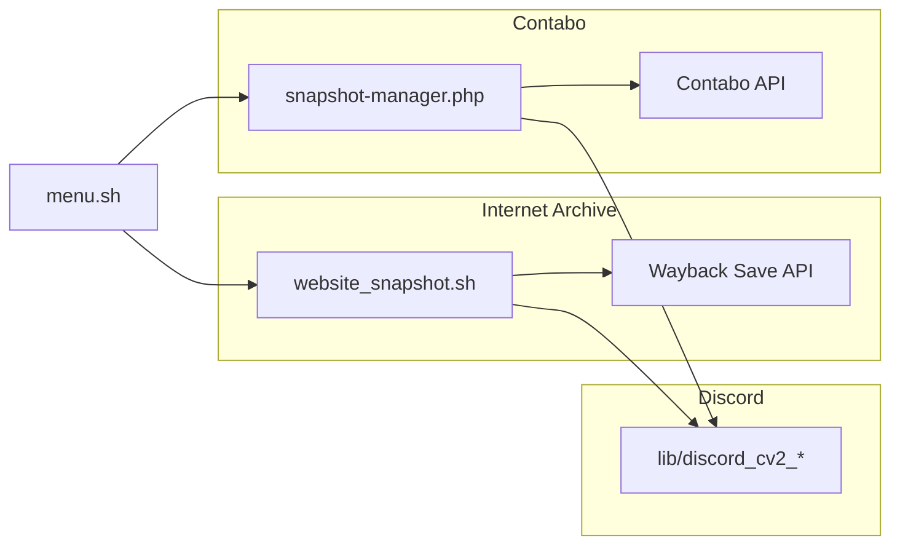

# MAS ChangeHub

[](https://github.com/master3395/MAS_ChangeHub/releases)
[](LICENSE)
[](https://github.com/master3395/MAS_ChangeHub/issues)
[](https://github.com/sponsors/master3395)

Unified snapshot tooling for **[NewsTargeted](https://newstargeted.com)**: Internet Archive (Wayback Machine) website captures, **Contabo VPS** instance snapshots, **Discord Components V2** run-status webhooks, and **Changelog-Announcement** (release posts to Discord).

**Documentation site:** [master3395.github.io/MAS_ChangeHub](https://master3395.github.io/MAS_ChangeHub/) (GitHub Pages)

---

## Table of contents

- [Features](#features)
- [Quick start](#quick-start)
- [Requirements](#requirements)
- [Project layout](#project-layout)
- [Migrating from contabo-snapshots](#migrating-from-contabo-snapshots)
- [Discord notifications](#discord-notifications)
- [Changelog announcements](#changelog-announcements)
- [Tests](#tests)
- [Documentation](#documentation)
- [Security](#security)
- [Contributing](#contributing)
- [Support and sponsors](#support-and-sponsors)
- [License](#license)

---

## Features

| Area | What it does |
|------|----------------|
| **Internet Archive** | Daily Wayback snapshots for NewsTargeted sites; configurable schedule, rate limits, and domain lists |
| **Contabo VPS** | Automated instance snapshots via Contabo API; retention and cleanup |
| **Discord CV2** | Section + Thumbnail webhook messages for archive and Contabo runs |
| **Changelog-Announcement** | Post release notes from `to-do/changelog.json` to Discord (`changehub` channel) |
| **Interactive menu** | `./menu.sh` for snapshots, cron, logs, config, and all tests |
| **Operator guides** | Full setup and tuning docs in [`guides/`](guides/) |



---

## Quick start

```bash
git clone https://github.com/master3395/MAS_ChangeHub.git
cd MAS_ChangeHub
./menu.sh
```

### Internet Archive

1. Copy `config/snapshot_config.conf.example` to `config/snapshot_config.conf` (`chmod 600`).
2. Set Internet Archive keys and Discord webhook URL.
3. Run `./website_snapshot.sh` or menu option **1**.

### Contabo VPS

1. Copy `contabo/config.php.example` to `contabo/config.php` (`chmod 600`).
2. Set Contabo API credentials and Discord webhook URL.
3. Run `php contabo/snapshot-manager.php` or menu option **11**.

### Cron (example)

```bash
# Archive (adjust time to match snapshot_config.conf)
0 3 * * * /home/MAS_ChangeHub/website_snapshot.sh >> /home/MAS_ChangeHub/logs/snapshot.log 2>&1

# Contabo
0 1 * * * /usr/bin/php /home/MAS_ChangeHub/contabo/snapshot-manager.php >> /home/MAS_ChangeHub/contabo/logs/cron.log 2>&1
```

---

## Migrating from contabo-snapshots

The standalone `/home/contabo-snapshots` tree is **retired**. Use MAS ChangeHub paths instead.

| Task | Old path | New path |
|------|----------|----------|
| **Run Contabo snapshots** | `php /home/contabo-snapshots/snapshot-manager.php` | `php /home/MAS_ChangeHub/contabo/snapshot-manager.php` |
| **Cron** | `php /home/contabo-snapshots/snapshot-manager.php` | `/usr/bin/php /home/MAS_ChangeHub/contabo/snapshot-manager.php` |
| **Config** | `/home/contabo-snapshots/config.php` | `/home/MAS_ChangeHub/contabo/config.php` |
| **Logs** | `/home/contabo-snapshots/logs/` | `/home/MAS_ChangeHub/contabo/logs/` |
| **Setup cron** | `/home/contabo-snapshots/setup-cron.sh` | `/home/MAS_ChangeHub/contabo/setup-cron.sh` |

Clone or pull this repo to `/home/MAS_ChangeHub` (or your deploy path), copy `contabo/config.php.example` to `contabo/config.php`, then run:

```bash
php /home/MAS_ChangeHub/contabo/snapshot-manager.php
```

---

## Requirements

| Component | Notes |
|-----------|--------|
| **OS** | Linux with cron (AlmaLinux / CyberPanel tested) |
| **Bash** | 4.x+ for menu and archive scripts |
| **PHP** | 7.4 to 8.x with `curl`, `json` for Contabo and Discord CV2 |
| **curl** | Website checks and Wayback API |
| **Git** | Clone and updates only |

---

## Project layout

| Path | Purpose |
|------|---------|
| `menu.sh` | Interactive CLI (archive + Contabo + tests) |
| `website_snapshot.sh` | Internet Archive runner (cron entry) |
| `config/` | `snapshot_config.conf` (gitignored) + example |
| `archive/` | Schedule tools: `schedule_manager.sh`, `apply_config_schedule.sh`, `check_snapshots.sh` |
| `contabo/` | Contabo snapshot manager and production PHP |
| `test/` | All test scripts (`test/` and `test/contabo/`); menu option **3** |
| `logs/` | Runtime logs (gitignored) |
| `lib/` | Shared helpers and Discord CV2 builders |
| `changelog-announcement/` | Changelog-Announcement CLI (Discord CV2 release posts) |
| `to-do/changelog.json` | MAS ChangeHub release changelog (source for `changehub` channel) |
| `guides/` | Operator documentation |
| `docs/` | GitHub Pages site source |
| `state/` | Rate-limit state (gitignored) |

Community files at repo root: `CODE_OF_CONDUCT.md`, `CONTRIBUTING.md`, `SECURITY.md`, `LICENSE`.

---

## Discord notifications

- Enable: `DISCORD_USE_CV2=true` in `config/snapshot_config.conf` or `contabo/config.php`.
- Hero images: [archive.png](https://newstargeted.com/assets/status-cv2/archive.png?v=2), [contabo.png](https://newstargeted.com/assets/status-cv2/contabo.png).
- Test via `./menu.sh` option **3**, or:
  - `./test/test-discord-webhook.sh` (archive)
  - `php test/contabo/test-discord-webhook.php` (Contabo)

See [guides/DISCORD-CV2-INTEGRATION.md](guides/DISCORD-CV2-INTEGRATION.md).

---

## Changelog announcements

**Changelog-Announcement** is bundled under `changelog-announcement/`. It posts structured release notes from `to-do/changelog.json` to Discord (channel name: `changehub`).

```bash
cd /home/MAS_ChangeHub/changelog-announcement

# Copy secrets template (chmod 600); set CHANGELOG_ANNOUNCEMENT_CHANGEHUB_URL
cp config.php.example config.php
cp bin/announce-changelog.env.example bin/announce-changelog.env 2>/dev/null || true

./bin/announce-changelog list
./bin/announce-changelog preview --channel=changehub
./bin/announce-changelog send --channel=changehub --version=2.0.1
```

After editing `to-do/changelog.json`, announce the latest entry before closing a release. Full operator docs: [changelog-announcement/to-do/README.md](changelog-announcement/to-do/README.md).

**Note:** Run-status webhooks (snapshot success/fail) use `lib/discord_notify_*.php`. Changelog announcements use the separate `changelog-announcement` tool.

---

## Tests

All test and debug scripts live under [`test/`](test/). Nothing in `test/` is used by production cron.

| Script | Purpose |
|--------|---------|
| `test/test_snapshot.sh` | Archive smoke test |
| `test/test-discord-webhook.sh` | Archive Discord CV2 |
| `test/contabo/test-discord-webhook.php` | Contabo Discord CV2 |
| `test/contabo/test-snapshots.sh` | Contabo manager integration |

Full list: [test/README.md](test/README.md).

---

## Documentation

| Guide | Topic |
|-------|--------|
| [guides/README.md](guides/README.md) | Internet Archive system overview |
| [guides/CONFIG-FILE-GUIDE.md](guides/CONFIG-FILE-GUIDE.md) | `snapshot_config.conf` reference |
| [guides/SCHEDULE-FREQUENCY-GUIDE.md](guides/SCHEDULE-FREQUENCY-GUIDE.md) | Cron and schedule tuning |
| [guides/QUICK-START-SCHEDULE.txt](guides/QUICK-START-SCHEDULE.txt) | Quick schedule setup |
| [guides/CONTABO-API-SETUP-GUIDE.md](guides/CONTABO-API-SETUP-GUIDE.md) | Contabo API credentials |
| [guides/DISCORD-CV2-INTEGRATION.md](guides/DISCORD-CV2-INTEGRATION.md) | Discord Components V2 |

---

## Security

Never commit `config/snapshot_config.conf` or `contabo/config.php`. They contain API keys and webhook URLs.

Report vulnerabilities via [SECURITY.md](SECURITY.md) (GitHub Security Advisories), not public issues.

---

## Contributing

We welcome issues and pull requests. Read [CONTRIBUTING.md](CONTRIBUTING.md) and [CODE_OF_CONDUCT.md](CODE_OF_CONDUCT.md) first.

- **Bug or feature:** [Open an issue](https://github.com/master3395/MAS_ChangeHub/issues/new/choose)
- **Pull requests:** target the `master` branch

---

## Support and sponsors

If this project saves you time on backups and archiving, consider sponsoring development:

**[Sponsor on GitHub](https://github.com/sponsors/master3395)**

You can also star the repo and open issues for bugs or ideas.

---

## License

[MIT](LICENSE) Copyright (c) 2026 Master3395
